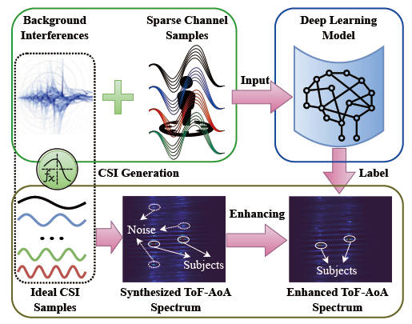

Enabling multi-person differentiation is crucial for the wide adoption of Wi-Fi sensing, so it is imperative for Wi-Fi sensing to gain GHz-level bandwidth and thus to achieve sufficient spatial resolution. Whereas stitching wide bandwidth leveraging continuous channel samples appears to be plausible, it is inefficient (if not impossible) in both time and frequency domains. Fortunately, as physical phenomena to be sensed are often sparse, acquiring GHz-bandwidth from sparse channel samples can be feasible. To this end, we propose CCS-Fi as a novel scheme to widen Wi-Fi sensing bandwidth, exploiting sparse and irregular channel samples. We start with establishing a compressive sensing framework to analyze the potential of realizing GHz sensing capability with only sparse channel samples. Then we propose a model-driven deep learning strategy to implement the sparse recovery process, aiming to derive radar-like channel response as direct output while overcoming the impossibility of obtaining labels for training. Through comprehensive experimental evaluations, we demonstrate that CCS-Fi achieves centimeterlevel resolution, effectively enabling indoor multi-person sensing.

  

