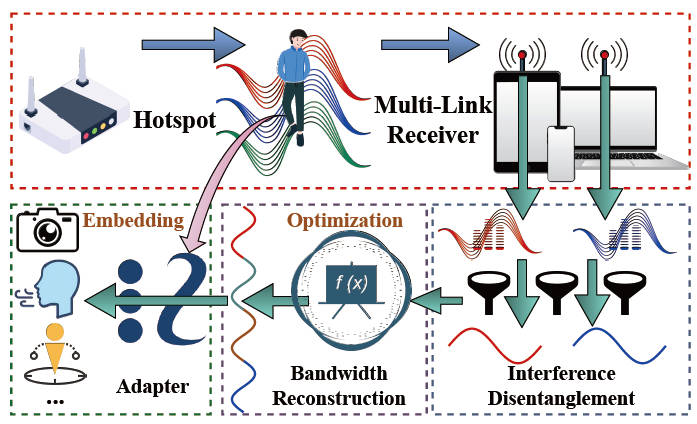

Wi-Fi is deemed as a promising sensing media due to its ubiquity, yet Wi-Fi sensing is known to be confined by its limited bandwidth that leads to insufficient range resolution. Though sampling a wider spectrum multiple times can enable wideband sensing, its practicality is still hampered by the need for accessing Wi-Fi firmware. In this paper, we propose $\mu$Ceiver-Fi to exploit spectrum resources for fine-granularity Wi-Fi sensing; it relies solely on a commodity multi-link receiver. Since the channel samples from multiple links under the same receiver can still be misaligned, we first innovate in a comprehensive calibration process to align these samples. This is followed by a novel optimization framework to extend effective sensing bandwidth to GHz-level using only a few channel samples. Finally, we specifically design a spectral representation for sensing information in order to bridge between wideband signals and diversified downstream applications. Through comprehensive evaluations in Wi-Fi pose estimation task, we demonstrate the promising performance of $\mu$Ceiver-Fi in fine-granularity sensing.

