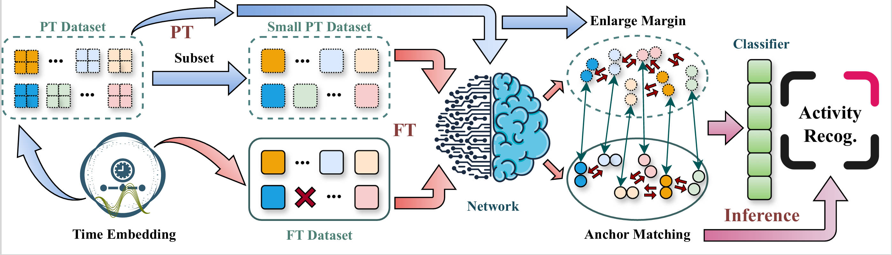

Wi-Fi-based human activity recognition (HAR) provides substantial convenience and has emerged as a thriving research field, yet the coarse spatial resolution inherent to Wi-Fi significantly hinders its ability to distinguish multiple subjects. By exploiting the near-field domination effect, establishing a dedicated sensing link for each subject through their personal Wi-Fi device offers a promising solution for multi-person HAR under native traffic. However, due to the subject-specific characteristics and irregular patterns of near-field signals, HAR neural network models require fine-tuning (FT) for cross-domain adaptation, which becomes particularly challenging with certain categories unavailable. In this paper, we propose WiAnchor, a novel training framework for efficient cross-domain adaptation in the presence of incomplete activity categories. This framework processes Wi-Fi signals embedded with irregular time information in three steps: during pre-training, we enlarge inter-class feature margins to enhance the separability of activities; in the FT stage, we innovate an anchor matching mechanism for cross-domain adaptation, filtering subject-specific interference informed by incomplete activity categories, rather than attempting to extract complete features from them; finally, the recognition of input samples is further improved based on their feature-level similarity with anchors. We construct a comprehensive dataset to thoroughly evaluate WiAnchor, achieving over 90% cross-domain accuracy with absent activity categories under multi-person scenarios.

